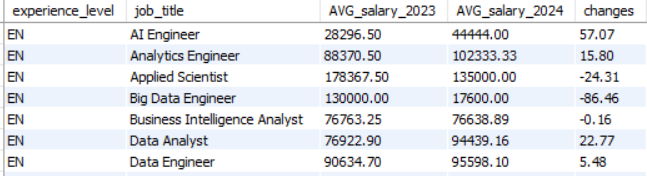
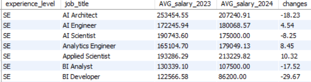

# Salaries_Aanalysis_In_SQL
## Overview
This project focuses on analyzing salary data from Data Science doamin to uncover trends, insights, and patterns in compensation across different job roles, and locations. The analysis is performed using SQL, providing efficient and scalable data querying capabilities.

## Insights
-The US is home to the largest companies, followed by Germany and Canada.
-24.37% of emplying are working remotely and getting more than $100000
- Some countries are providing more than average salaries to freshers for the particular job role, making them ideal for that job role to freshers. For example, US is better job location for fresher data analayst in terms of salary. Aulstralia is a better job location for fresher Business Intelligence Analyst, Canada for fresher Machine Learning Research Engineer and Germany for AI Engineer etc.
- India is providing highest salary for Admin & Data Analyst role, Canada is paying highest salary for AI Architect and AI Developer, and France for AI Programmer etc.
- The average salaries in the last 3 years(2022,2023,2024) are increasing year on year in Canada, France, India, Argentina, Spain, Finland, and Portugal
- 
- The percentage of peoply working remotely has decreased drastically from 2021 to 2021 for various experience level.

                                                                                          
- Top 5 paying jobs are Analytics Engineering Manager, Data Science Tech Lead, Head of Machine Learning, Managing Director Data Science, and AWS Data Architect.
- Top 5 paying jobs are Principal Data Architect, Compliance Data Analyst, Insight Analyst, Admin and Data Aanalyst, and Qualitative Research Analyst. 

## Dataset
- <b>Name:<b> Salaries.csv
- <b>Source:<b> Kaggle
- <b>Fields<b>
  - work_year
  - experience_level
  - employment_type
  - job_title
  - salary
  - salary_currency
  - salary_in_usd
  - employee_residence
  - remote_ratio
  - complany_location
  - company_size

 ## Tools & Technologies
- SQL (MySQL)
- MySQL Workbench
